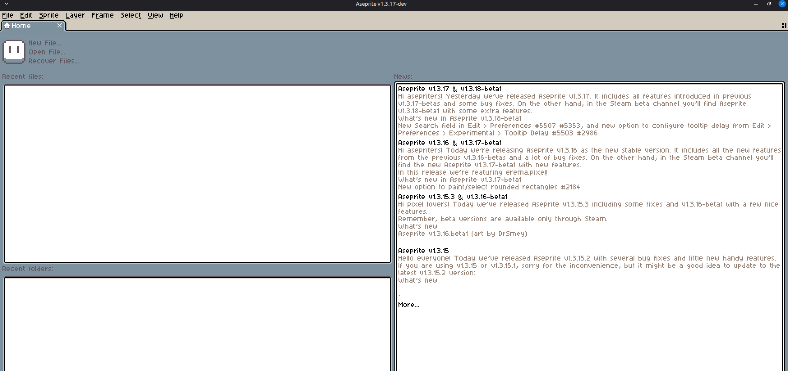

+++
title = "Compile Aseprite Sendiri Pakai Docker"
description = "Cara compile Aseprite sendiri dari source code pakai Docker biar sistem tetap bersih. Ada Dockerfile-nya juga, tinggal clone dan build deh!"
date = 2026-04-29T14:25:00+07:00
subtitle = "Bikin Portable Binary Tanpa Mengotori Sistem"
categories = ["Linux", "Docker"]
tags = ["aseprite", "linux", "tutorial"]
image = "/img/aseprite/docker-aseprite.jpg"
#draft: false
+++

こんにちはみんな! (^o^)/
Halo semua, kali ini saya mau berbagi catatan belajar tentang cara nge-build atau meng-compile Aseprite sendiri dari *source code*. Cocok banget buat kalian pengguna Linux yang suka bikin pixel art. Semoga bermanfaat..<!--more-->

Nah, sebenarnya compile Aseprite itu butuh banyak langkah dan *dependencies* (build tools). Kadang-kadang hal itu bisa bikin sistem utama kita jadi kotor dan penuh dengan package yang jarang terpakai. Oleh karena itu, saya menggunakan **Docker**! Dengan Docker, semua proses kompilasi berjalan di dalam *container* yang terisolasi. Asyique kan?

> **⚖️ PENTING: Mengenai Lisensi & Etika**
> Sesuai dengan lisensi EULA Aseprite:  
> ✅ **Boleh**: Mengunduh source code dan compile sendiri untuk penggunaan pribadi.  
> ❌ **Tidak Boleh**: Membagikan ulang hasil kompilasi (binary) ke orang lain.  
> Jadi pastikan kalian compile cuma untuk dipakai sendiri ya. Dukung terus developer aslinya! 🤝

### Persiapan & Repository

Pertama-tama, pastikan teman-teman sudah menginstall Docker dan punya RAM minimal 4GB (disarankan 8GB+ biar proses build-nya lebih ngebut).

Saya sudah menyiapkan *repository* yang isinya resep Dockerfile agar proses kompilasi ini serba otomatis. Kalian bisa *pull* atau *clone* reponya di sini:
[https://github.com/okutasan/aseprite-self-compile](https://github.com/okutasan/aseprite-self-compile)

Atau kalau kalian penasaran isi dari `Dockerfile`-nya, kurang lebih seperti ini:

```dockerfile
# Menggunakan Ubuntu 22.04 (Jammy) untuk kompatibilitas dependencies
FROM ubuntu:22.04

# Set non-interactive agar instalasi tidak nyangkut minta input zona waktu
ENV DEBIAN_FRONTEND=noninteractive

# Menentukan versi Aseprite dan Skia
ENV ASEPRITE_VERSION=v1.3.17
ENV SKIA_VERSION=m124-08a5439a6b

# Install semua build dependencies yang dibutuhkan
RUN apt-get update && apt-get install -y \
    g++ clang cmake ninja-build \
    libx11-dev libxcursor-dev libxi-dev libxrandr-dev \
    libgl1-mesa-dev libfontconfig1-dev curl unzip git \
    && rm -rf /var/lib/apt/lists/*

WORKDIR /build

# 1. Download & Extract Aseprite Source Code
RUN curl -LO "https://github.com/aseprite/aseprite/releases/download/${ASEPRITE_VERSION}/Aseprite-${ASEPRITE_VERSION}-Source.zip" && \
    unzip "Aseprite-${ASEPRITE_VERSION}-Source.zip" -d aseprite && \
    rm "Aseprite-${ASEPRITE_VERSION}-Source.zip"

# 2. Download & Extract Pre-built Skia (wajib untuk Aseprite UI backend)
RUN curl -LO "https://github.com/aseprite/skia/releases/download/${SKIA_VERSION}/Skia-Linux-Release-x64.zip" && \
    unzip Skia-Linux-Release-x64.zip -d skia && \
    rm Skia-Linux-Release-x64.zip

# 3. Proses Build menggunakan CMake dan Ninja
WORKDIR /build/aseprite/build
RUN export CC=clang && export CXX=clang++ && \
    cmake \
    -DCMAKE_BUILD_TYPE=RelWithDebInfo \
    -DCMAKE_CXX_FLAGS:STRING=-stdlib=libstdc++ \
    -DCMAKE_EXE_LINKER_FLAGS:STRING=-stdlib=libstdc++ \
    -DLAF_BACKEND=skia \
    -DSKIA_DIR=/build/skia \
    -DSKIA_LIBRARY_DIR=/build/skia/out/Release-x64 \
    -DSKIA_LIBRARY=/build/skia/out/Release-x64/libskia.a \
    -G Ninja .. && \
    ninja aseprite

# 4. Bikin Portable Archive
WORKDIR /build
# Folders di dalam bin/ sudah memuat executable dan data/ resource yang dibutuhkan
RUN tar -czvf aseprite-portable-linux.tar.gz -C /build/aseprite/build/bin .

CMD ["/bin/bash"]
```

### Cara Build Aseprite

Oke, sekarang kita masuk ke tahap eksekusi. Silakan buka terminal kesayangan kalian.

#### 1. Clone Repo

Ketik perintah ini untuk mendownload reponya dan masuk ke dalam folder tersebut.

```bash
╭─tuturu@tuturu ~  
╰─$ git clone https://github.com/okutasan/aseprite-self-compile.git
╭─tuturu@tuturu ~  
╰─$ cd aseprite-self-compile
```

#### 2. Jalankan Build

Sekarang kita mulai proses build-nya. Saran saya, gunakan flag `--cpus` untuk membatasi penggunaan core CPU supaya laptop/PC kalian tidak nge-*freeze* saat proses compile berjalan.

```bash
╭─tuturu@tuturu ~/aseprite-self-compile  
╰─$ docker build --cpus="4.0" -t aseprite-builder .
```

> Penjelasan :
> **docker build** : perintah untuk mem-build image docker baru.
> **--cpus="4.0"** : membatasi Docker agar maksimal hanya menggunakan 4 core CPU.
> **-t aseprite-builder** : memberikan nama/tag pada image.
> **.** : menggunakan Dockerfile di direktori saat ini.

Tunggu saja prosesnya sampai selesai. Silakan seduh kopi dulu karena ini memakan waktu beberapa menit.

#### 3. Ambil Binary-nya

Setelah build selesai, hasil kompilasinya masih terjebak di dalam Docker. Kita perlu mengambil file `.tar.gz` tersebut.

```bash
╭─tuturu@tuturu ~/aseprite-self-compile  
╰─$ docker create --name extractor aseprite-builder
╭─tuturu@tuturu ~/aseprite-self-compile  
╰─$ docker cp extractor:/build/aseprite-portable-linux.tar.gz .
╭─tuturu@tuturu ~/aseprite-self-compile  
╰─$ docker rm extractor
```

### Cara Menjalankan

Nah, sekarang kamu sudah punya *portable binary* Aseprite yang bersih! Ekstrak file yang sudah diambil tadi:

```bash
╭─tuturu@tuturu ~/aseprite-self-compile  
╰─$ mkdir -p ~/Aseprite
╭─tuturu@tuturu ~/aseprite-self-compile  
╰─$ tar -xzvf aseprite-portable-linux.tar.gz -C ~/Aseprite
```

Lalu jalankan aplikasinya:

```bash
╭─tuturu@tuturu ~  
╰─$ ~/Aseprite/aseprite
```


Yatta! Aseprite kalian sudah berhasil dijalankan. Insyaallah berhasil hehe ^^.
Jika nanti Aseprite merilis versi baru, kalian tinggal edit file `Dockerfile` pada bagian `ASEPRITE_VERSION`, lalu ulangi proses build-nya.

Semoga catatan belajar saya ini bermanfaat.


じゃ、また ヾ(＾-＾)ノ
